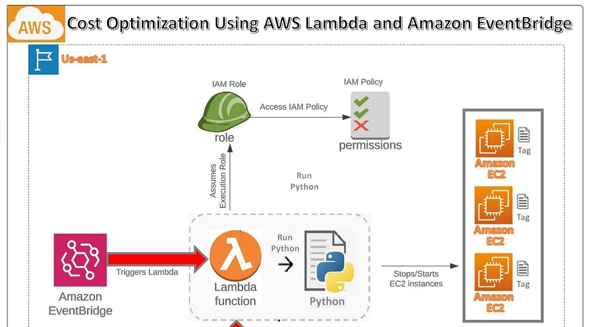

# AWS EBS Snapshot Cost Optimization using Lambda

## 📌 Overview
This project implements an automated **AWS cost optimization solution** using **AWS Lambda** to identify and delete **unused or old EBS snapshots**, helping reduce unnecessary storage costs.

The solution follows **least-privilege IAM**, uses **serverless architecture**, and is designed to run automatically on a schedule.

---

## 🏗️ Architecture
- AWS Lambda (Python)
- Amazon EC2 (EBS Snapshots)
- IAM (Execution Role & Policies)
- Amazon CloudWatch Logs
- Amazon EventBridge (Scheduler)

---

## ⚙️ How It Works
1. EventBridge triggers the Lambda function on a schedule
2. Lambda retrieves all **self-owned EBS snapshots**
3. Filters snapshots older than a defined retention period
4. Deletes unused snapshots
5. Logs execution details in CloudWatch

---

## 🛡️ IAM & Security
- Implemented **least-privilege IAM policies**
- No use of `AdministratorAccess`
- EC2 permissions restricted to snapshot-related actions only

IAM policy used:
